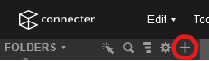
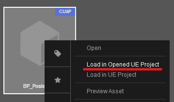
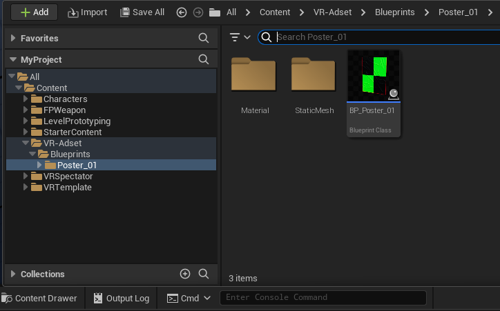
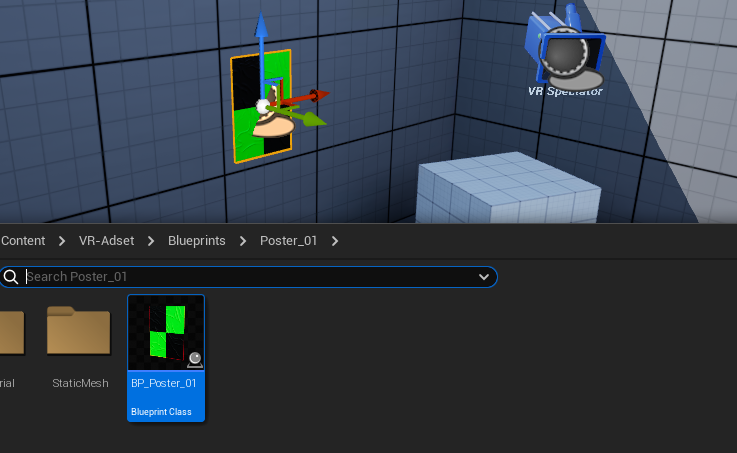
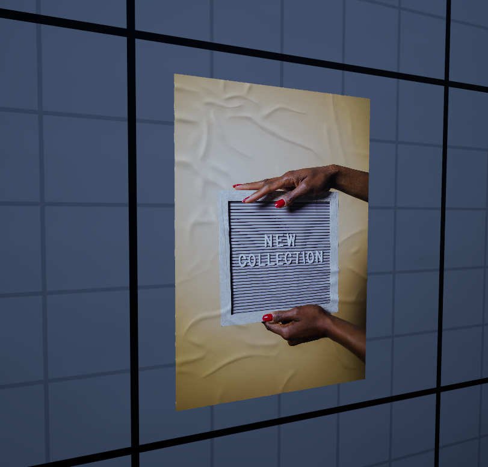

# VR-adset

VR-Adset offers advertisers the opportunity to reach a new audience by showcasing their ads within a virtual reality (VR) environment. Achieved with the use of pre-built 3D objects like billboards and TVs, the platform simplifies the current available process of advertising. Currently, most companies reach out to agencies who build the entire VR environment for the use of only one ad campaign. This approach easily becomes costly due to developer fees and is time-consuming.

Simplifying the available processes of advertising, VR-Adset creates a mutually beneficial setup not only for advertisers and developers but also for the VR industry. It aims to provide developers with an alternative source of income, whilst being easy to use, reaching new audiences, and offering constant availability with wider adoption by developers.

## Tutorial for Advertisers

You are in luck!

All you have to do is Sign up to <https://vr-adset.com> to upload an advertisement and the Developer will do the rest.

Enjoy the savings on development and get ready to reach a new audience.

## Tutorial for Developers

How to use VR-Adset with Connecter and Unreal Engine

### Required Software

- Connecter
- Unreal Engine

### Introduction to Connecter

If you're new to Connecter, start by watching this 6-minute introductory video. It covers the basics and setup of required plugins.

### Tutorial Steps

#### 1. Prepare Your File

Sign Up or Log in to <https://vr-adset.com>

Download an asset and save the .cuap file to a directory on your computer, such as ../desktop/VR-Adset.

#### 2. Set Up Connecter

Open the Connecter app.

Navigate to the 'Folders' section on the left hand side, and click the "+" icon to add a custom folder.

Add custom folder icon.
Select the directory where you saved the .cuap file. Your file should now appear in Connecter. Adding more assets to this directory will automatically update Connecter.

#### 3. Prepare Unreal Engine

Open Unreal Engine.

Either open an existing VR project or create a new one. To create a new project, select 'Games', 'Virtual Reality', then press 'Create'.

#### 4. Import Assets into Unreal Engine

Go back to Connecter, right-click the asset you want to use, and select "Load in Opened UE Project".

Showcase of the Load in Opened UE Project option from Connecter.
In Unreal Engine, open the Content Drawer and locate the "VR-Adset" folder.

Navigate to "VR-Adset/Blueprints/" and open the asset’s folder.

The directory of the asset within Unreal Engine, Content Drawer.
Drag and drop the Blueprint asset from this folder into your Unreal Engine environment.

Showcase of asset being dragged and dropped within the VR environment.

#### 5. Run Your Project

Launch the simulation or run it as a standalone game. Your asset with the advertisement should now display correctly in the environment.

[EOF]